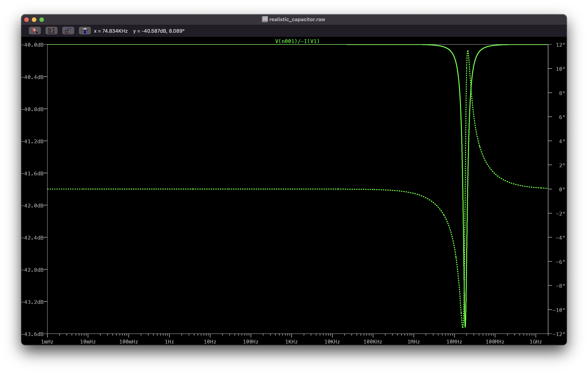

# LAB 1 – Measuring “parasitic” properties of passive components with a VNA

## Authors

Author : John Kustin  
Lab partner: Yifan Zhu

## Abstract

## Background

In introductory circuits courses, passivie components like resistors, capacitors, and inductors are studied in order to understand their impedances. Simple models have been created which describe (theoritecally) the impedance of each device. For a resistor, capacitor, and inductor, their (ideal) impedances are respectively

$$Z_R = R  \newline
Z_C = 1/j\omega C = -j/\omega C \newline
Z_L = j\omega L$$

where R, C, L are the resistance, capacitance, and inductance, but $\omega = 2\pi f$, where $f$ is frequency in Hertz.

When these components are realized in real life, the construction of each tends to yield **parsitics**. For the purpose of this investigation, we consider parasitics as uninteded side-effects to the operation of the component that is inherent to its physical construction. The well-understood (by others, not us yet) parasitics that are commonly included in more sophisticated models are

> The realistic capacitor

> The realistic inductor

> The realistic resistor

In this lab we will study the parasitic effects of the real-life capacitor and inductor. In the process of doing so, we will gain experience with a Vector Network Analyzer.

## Experimental Setup

Before we start measuring real-life impedances of real-life components we would like to form expectations for what we should see. 

### LTSpice

#### Capacitor
This LTSpice testbench was used to measure the impedance of the realistic capacitor model.

The parasitics are included within the capacitor model's settings:

#### Inductor

This LTSpice testbench was used to measure the impedance of the realistic inductor model.

The parasitics are included within the inductor model's settings:

Both testbenches use a voltage source with an AC signal amplitude of $1 V$ so that when the division $Z(j\omega) = V(j\omega) / I(j\omega)$ is performed with the measured current, the result is the true impedance (not scaled by an arbitrary factor).

### NanoVNA

Impedance measurements were performed with the NanoVNA.

We used the VNA to measure the impedances of test fixtures on an RF demo board. We calibrated the VNA according to SOLT calibration each time the cable type of the VNA was changed.

We also used the VNA to measure the impedances of larger, through-hole components. A custom "mount" was made with two SMA connectors and copper clad in order to hook the DUT up with the VNA.

The discrete components were soldered and un-soldered to this fixture because only one fixture was created.
## Measurements and Results

#### LTSpice Capacitor
The AC sweep of the capacitor impedance yielded 

The notch is approximately located at 19 MHz.
#### LTSpice Inductor
The AC sweep of the inductor impedance yielded

The notch is approximately located at 503 MHz.
#### NanoVNA Capacitor

#### NanoVNA Inductor

## Discussion
From each impedance versus frequency graph we can observe the presence of a reasonant frequency in both the inductor and capacitor. The impedance for an inductor increases while the capacitor's decreases. The circuit intuition is as follows:
- For the inductor, when $f$ is much below the resonant frequency $f_o$, $f << f_o$, the actual inductor looks like a short, the parasitic parallel capacitor looks like an open, so the impedance of the series resistor dominates. When $f >> f_o$ the capacitor looks like an short, the inductor looks like an open, so the capacitance dominates the impedance. At resonant frequency, no component can be "assumed to be negligant", so the impedance is greatest. So on either ends, there is a relatively lower impedance than at the resonant frequency.
- For the capacitor, when $f << f_o$, the capacitor looks like an open. When $f >> f_o$ the inductor looks like an open. So on either extreme, there is a relatively higher impedance than at the resonant frequency.

All of this discussion points to the *unfortunate* reality that passive components in real-life are not ideal. In fact, their impedances may be widely different from the ideal models of impedance described in the Background section. Going further, if a specific component with a resonant frequency is used in the frequency range of resonance, the behavior of the circuit would deviate from expectations.
## Conclusions