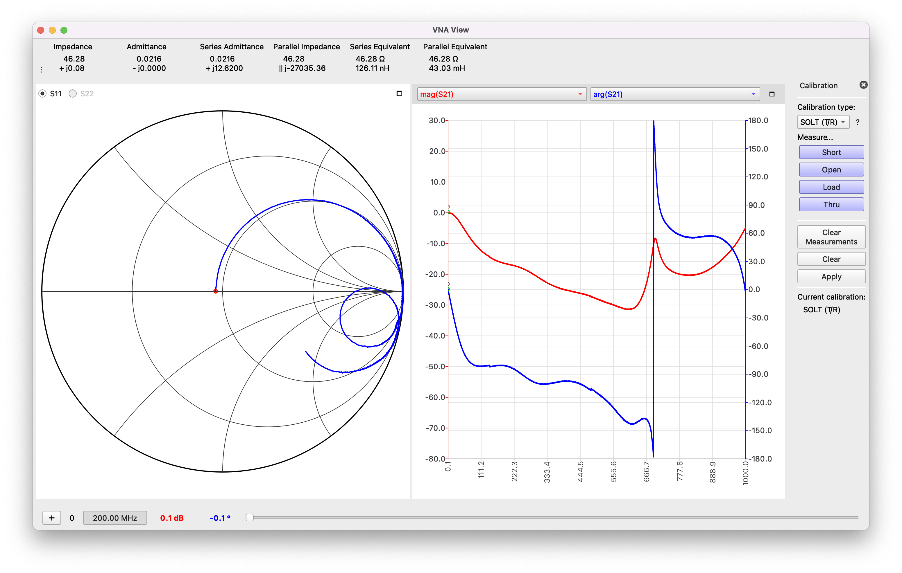

# LAB 1 – Measuring “parasitic” properties of passive components with a VNA

## Authors

Author : John Kustin  
Lab partner: Yifan Zhu

## Abstract
The impedances of real-life passive components can be vastly different from their ideal circuit models. This deviation is typically caused by parasitics. In order to investigate this phenomenon, a vector network analyzer is used to measure the impedances of real-life capacitors and inductors. 
## Background

In introductory circuits courses, passivie components like resistors, capacitors, and inductors are studied in order to understand their impedances. Simple models have been created which describe (theoritecally) the impedance of each device. For a resistor, capacitor, and inductor, their (ideal) impedances are respectively

$$Z_R = R  \newline
Z_C = 1/j\omega C = -j/\omega C \newline
Z_L = j\omega L$$

where R, C, L are the resistance, capacitance, and inductance, but $\omega = 2\pi f$, where $f$ is frequency in Hertz.

When these components are realized in real life, the construction of each tends to yield **parsitics**. For the purpose of this investigation, we consider parasitics as uninteded side-effects to the operation of the component that are inherent to its physical construction. Each of the resistor, inductor, and capacitor have an ideal impedance, so each of their parasitics would cause deviations from their ideal models. How bad the deviation can get will be demonstrated in the following sections. The well-understood (by others, not us yet) parasitics that are commonly included in more sophisticated models are

> The realistic capacitor

> The realistic inductor

> The realistic resistor

In this lab we will study the parasitic effects of the real-life capacitor and inductor. In the process of doing so, we will gain experience with a Vector Network Analyzer.

## Experimental Setup

Before we start measuring real-life impedances of real-life components we would like to form expectations for what we should see. 

### LTSpice

#### Capacitor
This LTSpice testbench was used to measure the impedance of the realistic capacitor model.

The parasitics are included within the capacitor model's settings:

#### Inductor

This LTSpice testbench was used to measure the impedance of the realistic inductor model.

The parasitics are included within the inductor model's settings:

Both testbenches use a voltage source with an AC signal amplitude of $1 V$ so that when the division $Z(j\omega) = V(j\omega) / I(j\omega)$ is performed with the measured current, the result is the true impedance (not scaled by an arbitrary factor).

### NanoVNA

Impedance measurements were performed with the NanoVNA.

We used the VNA to measure the impedances of test fixtures on an RF demo board. We calibrated the VNA according to **SOLT** calibration each time the cable type of the VNA was changed.

We also used the VNA to measure the impedances of larger, through-hole components. A custom "mount" was made with two SMA connectors and copper clad in order to hook the DUT up with the VNA.

## Measurements and Results

#### LTSpice Capacitor
The AC sweep of the capacitor impedance yielded 

The notch is approximately located at 19 MHz.
#### LTSpice Inductor
The AC sweep of the inductor impedance yielded

The notch is approximately located at 503 MHz.
#### NanoVNA Capacitor

The first two figures show impedance measurements for the surface-mount capacitor on the RF evaluation board. The first figure sweeps frequency from 10 to 100 MHz, while the second sweeps from 1 MHz to 2 GHz.

The third figure measures impedance for a through-hole capacitor from 0.1 MHz to 4 GHz.

#### NanoVNA Inductor

The first two figures show impedance measurements for the surface-mount inductor on the RF evaluation board. The first figure sweeps frequency from 10 to 100 MHz, while the second sweeps from 1 MHz to 2 GHz. The S11 corresponds to the impedance of the DUT because the *input* port of the DUT is driven by the VNA and the *output* port is grounded.

The third figure measures impedance for a through-hole inductor from 0.1 MHz to 1 GHz. The S21 corresponds to the impedance of the DUT because the *input* port of the DUT is driven by the VNA and the *output* port is measured by the VNA.

## Discussion
The LTSpice simulations predicted that real-life inductors and capacitors have reasonant frequencies which dramatically affect each component's impedance. The VNA measurements verify this case.

- The measured impedance of the discrete inductor (using the SMA test structure) reveals a resonant frequency around 700 MHz.  
- The measured impedance of the discrete capacitor (using the SMA test structure) reveals a resonant frequency between 2.222 GHz and 2.666 GHz.  
- The measured impedance of the surface mount inductor (using the RF test board) reveals a resonant frequency around 200 MHz.  
- The measured impedance of the surface mount capacitor (using the RF test board) reveals a resonant frequency around 300 MHz.  

Note that the frequency ranges which reveal resonance are different for each component. This behavior implies that one may need to search for the resonant frequency of any given component.

The resonant frequency of each structure can be **roughly** identified by noticing either the impedance peaks/droops, or the asymptotic impedance behavior.
At the resonant frequency, the impedance for an inductor increases while the capacitor's decreases. 

The circuit intuition for this behavior is:
- For the inductor, when $f$ is much below the resonant frequency $f_o$, $f << f_o$, the actual inductor looks like a short, the parasitic parallel capacitor looks like an open, so the impedance of the series resistor dominates. When $f >> f_o$ the capacitor looks like an short, the inductor looks like an open, so the capacitance dominates the impedance. At resonant frequency, no component can be "assumed to be negligant", so the impedance is greatest. So on either ends, there is a relatively lower impedance than at the resonant frequency.
- For the capacitor, when $f << f_o$, the capacitor looks like an open. When $f >> f_o$ the inductor looks like an open. So on either extreme, there is a relatively higher impedance than at the resonant frequency.

## Conclusions

All of this discussion points to the *unfortunate* reality that passive components in real-life are not ideal. In fact, their impedances may be widely different from the ideal models of impedance described in the Background section. Going further, if a specific component with a resonant frequency is used in the frequency range of resonance, the behavior of the circuit would deviate from expectations.

One way to improve the quality of measurements through the SMA fixtures is to use as short of leads as possible between the DUT and the SMA pins. Using shorter leads implies less inductance and resistance from the wires itself, so the impedance measurement is more true to the actual DUT. 

The presented measurements and plots are limited by the granularity of the impedance versus frequency sweep. To achieve an ideal measurement, an infinite amount of points measured by the VNA is required. Therefore, the plots derived from the VNA should not be considered "complete" representations of a any given component's impedance versus frequency behavior. The lesson learned from this limitatation is that if one wishes to characterize the impedance of an absolutely critical structure in a circuit, using as many points as possible in that measurement would yield the best characterization.