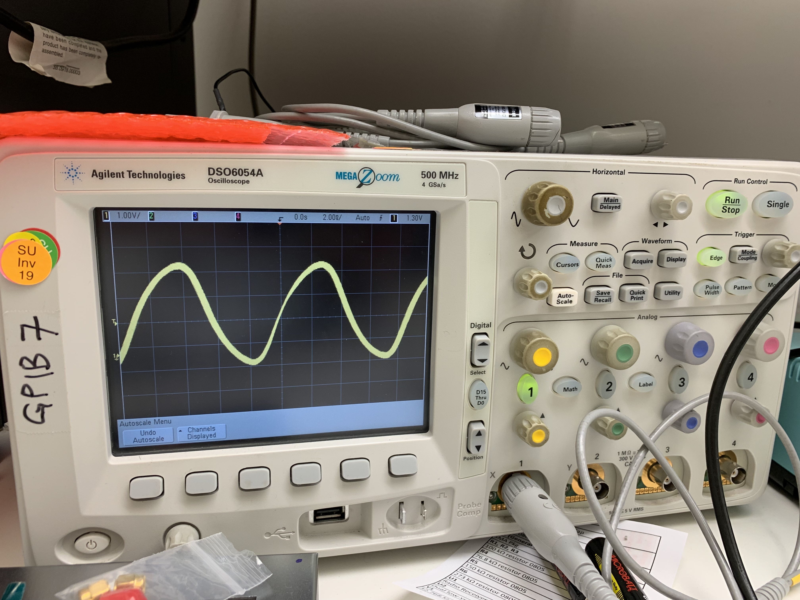

# LAB 2 – Clock Generation with a Si5351

## Authors

Author : John Kustin  
Lab partner: Yifan Zhu

## Abstract
TODO
- Clocks are basically in ALMOST EVERY system you will work on
## Background

Previous iterations of Stanford University's Analog Communications Design Laboratory (EE133/233) had a lab on oscillators. In the past, they built <a href="https://en.wikipedia.org/wiki/Colpitts_oscillator"> Colpitts oscillators </a>. Times have changed and the current landscape of electronics is such that the number of times one will need to generate a clock is far greater than the number of times one would benefit from building a Colpitts oscillator. 

This lab is meant to introduce the emerging engineer to a *modern*, low-cost, and widely used clock generator -- the <a href="https://cdn-shop.adafruit.com/datasheets/Si5351.pdf"> Si5351 </a> -- and the mechanisms which enable it, e.g. a fractional-N PLL. This part has a low price point, reasonable performance, and successful history (it is used in the NanoVNA V2 that was used in Lab1!). The experience gained through this lab can be carried forward in a young engineer's career as they embark on projects that will most certainly include clock generation.[^1]

This lab uses <a href ="https://circuitpython.org"> Circuit Python</a>, which enables low-stress communication with embedded microcontrollers through a Python API.

[^1]: This background is pulled from Steve Clark's <a href="https://canvas.stanford.edu/courses/148940/discussion_topics/722850"> Canvas Announcement </a>.

## Experimental Setup

The hardware used in this lab includes:
- <a href="https://learn.adafruit.com/adafruit-si5351-clock-generator-breakout/downloads">Adafruit Si5351 breakout board</a>
- <a href="https://learn.adafruit.com/introducing-adafruit-itsybitsy-m4">ItsyBitsy M4 microcontroller</a>
- 3x male edge-launch SMA adapters for 62 mil thick PCB
- solderless breadboard
- jumper wires
- oscilloscope and probe
- spectrum analyzer and probe

The spectrum analyzer used was the Agilent N1996A, which has a bandwidth of 100 kHz to 6 GHz. The oscilloscope used was the Agilent DSO6054A, which has a bandwidth of DC to 500 MHz and is capable of 4 Gigasamples per second.

<figure>

<figcaption align="center">Fig. 1 - An Adafruit Si5351 breakoutboard with attached SMA adapters connected to an ItsyBitsy M4 microcontroller through a solderless breadboard. An oscilloscope probe is attached to the <code>clk0</code> port of the breakout board. </figcaption>
</figure>

The code which controlls the clock generation is from an <a href="https://learn.adafruit.com/adafruit-si5351-clock-generator-breakout/circuitpython">Adafruit tutorial</a> for the Si5351 breakout board. As shown in Figure 1 there are three output clocks <code>clk0, clk1,</code> and <code>clk2</code>. They are respectively set to generate clocks at 112.5 MHz, 13.553115 MHz, and 10.76 kHz. Summarizing the tutorial, the clock generation happens by i) using a 25 MHz crystal as a stable source of oscillation for the oscillator ii) feeding the output of the oscilator to the two on-chip N-fractional PLLs and iii) controlling the PLLs through I2C. Please refrence the <a href="https://learn.adafruit.com/adafruit-si5351-clock-generator-breakout/circuitpython"> Adafruit Si5351 breakout board tutorial </a> and Si5351  <a href="https://cdn-shop.adafruit.com/datasheets/Si5351.pdf"> datasheet</a> for more details.

## Measurements and Results

In this section we will view the time and frequency domains of the three different clocks.

In Figure 2 the 10.70 kHz clock is visible in the frequency and time domains. On the left hand side of the figure, the fundamental frequency (10.70 kHz) has about 48 dB of spurious free dynamic range (SFDR) and has about 70 dB separation from the noise floor. The span of the measuremeant is 13 kHz, so the view is not able to show the odd harmonics of a square wave. On the right hand side we can see a crisp square wave that has minor over/under-shoot at the rising and falling edges, respectively. The defined levels of the clock (HI/LO) are constant, absent from the noise which gives the levels some "thickness".

<figure>

<figcaption align="center">Fig. 2 - Left: Frequency spectrum of 10.70 kHz clock. Center frequency is 10.70 kHz. Span of the window is 13 kHz. Resolution bandwidth is 130 Hz. 401 points were collected for the spectrum. Right: Voltage versus Time view of 10.70 kHz clock. The plot uses 20 microsecond divisions in the horizontal direction and 1 Volt divisons in the vertical direction. </figcaption>
</figure>

Figure 3 shows the 13.552 MHz clock in the frequency and time domains. On the left hand side of the figure, the fundamental frequency (13.552 MHz) has about 48 dB of spurious free dynamic range (SFDR) and has roughly 60 dB separation from the noise floor. The span of the measuremeant is 312 kHz. On the right hand side we can see some distortions in the square wave. The slew of the rising and falling edges is weaker than in the 10.70 kHz case. The under and over shooting are more pronounced than before.

<figure>

<figcaption align="center">Fig. 3 - Left: Frequency spectrum of 13.552 MHz clock. Center frequency is 13.552 MHz. Span of the window is 312 kHz. Resolution bandwidth is 3.12 kHz. 401 points were collected for the spectrum. Right: Voltage versus Time view of 13.552 MHz clock. The plot uses 20 nanosecond divisions in the horizontal direction and 1 Volt divisions in the vertical direction.</figcaption>
</figure>

Figure 4 displays the 112.50 MHz clock in the frequency and time domains. The spectra of the signal shows that the fundamental has about 48 db of SFDR and about 65 dB of separation from the noise floor. The span of the measurement is 2 MHz. The time domain view of the "clock" is almost unrecognizable. The signal appears more sinusoidal than square. There is no under/over shooting -- instead, the slew rate of the 112.50 MHz signal is the slowest of the three clocks. 

<figure>

<figcaption align="center">Fig. 4 - Left: Frequency spectrum of 112.50 MHz clock. Right: Voltage versus Time view of 112.50 MHz clock. </figcaption>
</figure>

## Discussion

It seems that as the desired output frequency is increased, the output clock appears more sinusoidal than square-like. We propose two hypotheses: i) the clock-generation circuit cannot perform as fast as we want it to; ii) higher frequency content is more attenuated in its propagation from output of the Si5351 to input of the oscilloscope, so faster signals are naturally more attenuated. The first hypothesis is incorrect because the datasheet reports the device can supply output clocks up to 160 MHz. The more likely culprit for the degradation in shape is the attenuation of high frequencies from the parasitics of the traces, leads, packages, etc. 

- The manufacturer claims that an Si5351 can generate frequencies from around 8 kHz to around 160 MHz. The recommended crystal frequency is 25 MHz. How can it generate frequencies in excess of 6X the basic clock rate?
- How do I know which frequencies are able to be generated?
- Can I modify the CircuitPython code to generate a frequency (or two) of my choice?
- Does it really work to write TRUE or FALSE to a particular place and turn that particular output ON / OFF?
- It seems like when the output frequency is "high" the square wave output turns into a more sinusoidal waveform. Why is that?
- What if I want a sine wave, or triangle wave, or saw-tooth wave... Can I use this to generate those waveforms?
- I've been thinking a lot about generating in-phase (I) and in-quadrature (Q) signals to drive mixers. Can I use this clock generator to directly generate I & Q for my mixer drive?
- If I wanted to try designing a PLL, might this be a gizmo that I could use to test my PLL?
- What is phase noise? And how is it related to "jitter"? And it this a low-noise part? Or not? How can I tell?
- So, Steve, if this is used for the "low frequency regime", what is used in the "high frequency regime" to provide the signal source in the NanoVNA V2 Plus4?

## Conclusions

TODO

