# LAB 3 – Making a Diode-Ring Mixer

## Authors

Author : John Kustin  
Lab partner: Yifan Zhu

## Abstract
Mixers are ubiquitos in RF systems. In this lab, we gain hands on experience with how diode-ring mixers work by building one. Then, we attemp to measure some fundamental performance characteristics of the mixer. As a result of this work, we are capable in understanding the role mixers play in a larger circuit and how to quantify its ability to mix well.
## Background

Fundamentally, mixers multiply time domain signals. As a result of the signals being sinusoids, the multiplication generates the sum and difference frequencies of those input sinusoids. The mixer goes by many other names, including "modulator / demodulator", "multiplier", "synchronous detector", "phase detector", "upconverter / downconverter". These names hint at the many applications a mixer is used in, e.g. modulation/demodulating a signal to encode information.

Let  and . Then . Mixing sinusoids generates a sum and difference frequency.

For downconversion, a mixer requires a radio frequency signal (RF) and a local oscillator (LO) to generate an intermediate frequency signal (IF). For upconversion, a mixer requires an IF signal and an LO to generate *two* RF signals. Figure B.1 shows two examples of frequency conversion.[^1] 

[^1]: Figure B.1 is taken from Steve Clark's slides for Stanford's EE133 course during the Winter of 2022 offering.

The figure demonstrates high side injection in the downconversion case. High side injection means your LO frequency is higher than your RF signal. 

<figure>
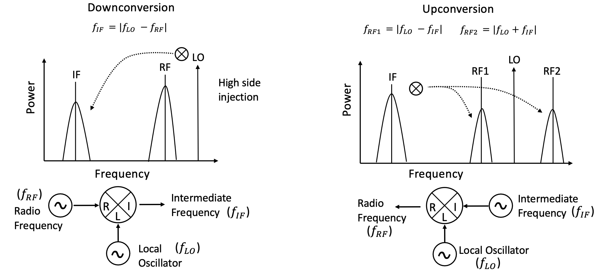
<figcaption>Figure B.1 - An example of frequency conversion. The mixer is a three port device and has two directions to shift a frequency. The figure demonstrates the effect of downconversion and upconversion in the frequency domain. </figcaption>
</figure>

Mixing can be done with the double balanced diode-ring circuit in Figure B.2. The mixer is completely passive -- there are no active devices in the circuit. This fact has consequences for conversion gain/loss and will be explored later.

<figure>
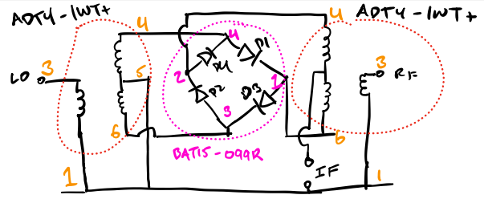
<figcaption>Figure B.2 - A schematic view of the mixer. It uses two transformers and one diode ring. The orange numbers correspond to the pin numbers on the ADT4-1WT+ package. The pink numbers correspond to the pin numbers on the BAT15-099R package. </figcaption>
</figure>

A derivation of how the circuit in Figure B.2 performs the multiplication is left to a circuits course.

## Experimental Setup

Figure ES.1 shows the constructed mixer. Figure ES.2 (left) shows the same mixer being driven by a signal generator and being measured by a spectrum analyzer.
<figure>
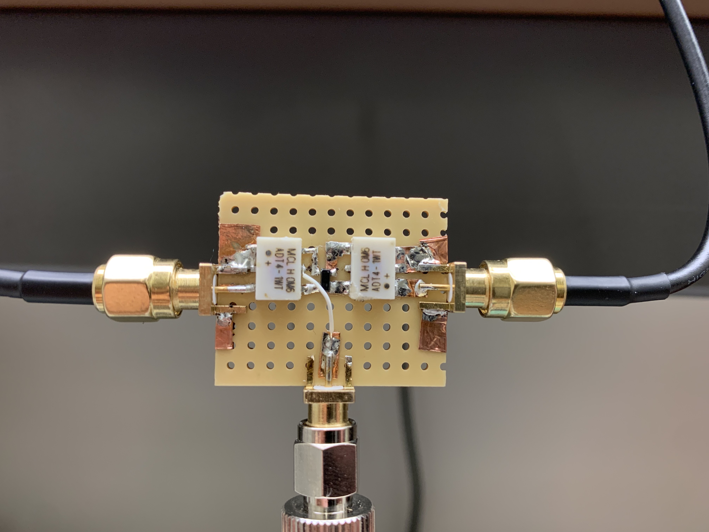
<figcaption>Figure ES.1 - The mixer constructed in the lab. It consists of a <a href="https://rocelec.widen.net/view/pdf/qxnorbh6l6/INFNS15420-1.pdf?t.download=true&u=5oefqw">BAT15-099R diode-ring</a> and two <a href="https://www.minicircuits.com/pdfs/ADT4-1WT+.pdf"> ADT4-1WT+ transformers </a>. The left, right, and middle ports are respectively for RF, LO, and IF. </figcaption>
</figure>

<figure>
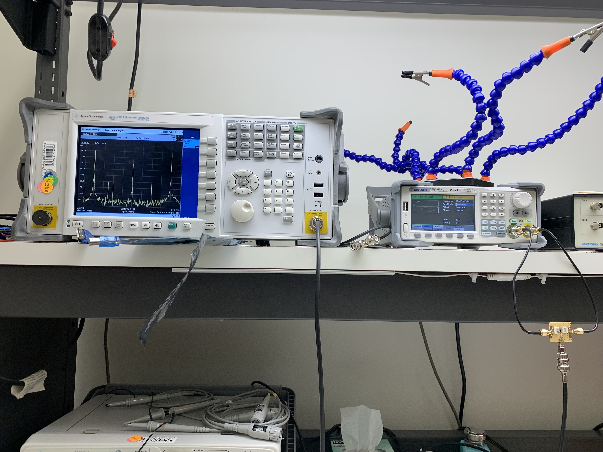
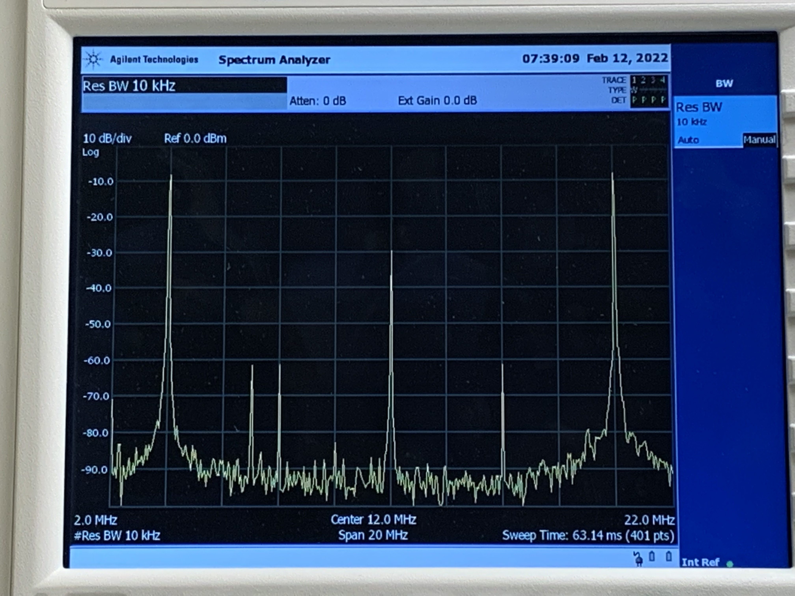
<figcaption>Figure ES.2 - Functional verification of the mixer. The RF is an 8 MHz signal being mixed with a 12 MHz LO. The sum and difference signals are visible in the frequency domain (right hand picture) at 4 and 20 MHz. There is a noticable amount of LO leakage seen at 12 MHz. Three other spurs are visible between 8 and 10 MHz, and at 16 MHz. </figcaption>
</figure>

The right side of Figure ES.2 shows a close up of the spectrum for the mixing of an 8 MHz RF signal with a 12 MHz LO. The sum and difference frequencies are at 4 and 20 MHz. The LO leakage can be visibally seen at the frequency of the local oscillator, 12 MHz -- the spectral power of the LO is 100 times smaller than the power of either the sum or difference frequencies. Many other spurs can be seen, which are most likely the result of intermodulation due to the nonlinear diode ring.

All spectrum analyzer measurements used 100 samples of exponentially-weighted averaging.
## Measurements and Results

To study the 1 dBm compression point and conversion gain/loss, the IF power was measured for different RF. The LO was an 8 MHz sinusoid at 7 dBm. The input RF power was stepped from -1 dBm to 7 dBm in +1 dBm increments. At each step, the output IF power was measured. From this data, the 1 dBm compression point and conversion loss were computed and are shown in figures MR.1 and MR.2.

<figure>
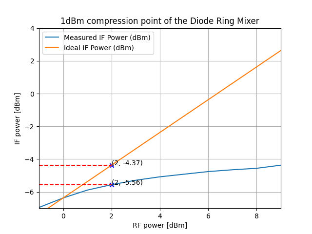
<figcaption>Figure MR.1 - Measured IF power as a function of different RF powers. The 1 dBm compression point occurs just beyond 1 dBm of RF power. </figcaption>
</figure>

Figure MR.1 reveals that the diode ring mixer reaches its 1 dBm compression point just under 2 dBm of RF power. The "ideal" IF curve was computed according to <code>IdealIFpower = RFpower + conversion[1]</code> where <code>conversion[1]</code> is the conversion loss of a 0 dBm RF signal. The code which made these charts is in <code>graphs.py</code> of this folder.

Figure MR.2 reveals that the conversion loss of the mixer is not constant across RF powers. The chart suggests that the diode ring mixer has a maximum amount of power it can output. This result is derived from the fact that as RF power increases, the conversion loss grows larger. By the formula for conversion gain (<code>conversion = (IF power)[dBm] - (RF power)[dBm].</code>), the data suggests that the output IF power delivered to the spectrum analyzer is constant beyond some point. More investigation is needed to understand the true source of the conversion loss.
<figure>
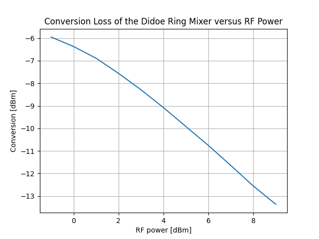
<figcaption>Figure MR.2 - Computed conversion loss as a function of different RF powers. The conversion loss is around 6 dBm for RF powers below 1 mW. The conversion loss is in dBm computed according to <code>conversion = (IF power)[dBm] - (RF power)[dBm].</code></figcaption>
</figure>

The conversion loss of the passive diode-ring mixer at low RF powers is around -6 dB. This number is about what is expected according to the following <a href="https://www.qsl.net/va3iul/RF%20Mixers/RF_Mixers.pdf"> publication</a>.

Figure MR.3 shows the spur levels of the mixer when the LO is a 7 dBm 30 MHz sinusoid and the RF is a 0 dBm 7 MHz sinusoid. Over a 60 MHz span many spurs are visible. The up and down mixed IF signals have around -10 dBm power and are distinct from the other spurs. The different spurious frequencies are given by the formula . Because the sum and difference frequencies are at least 30 dB (1000x power difference) above the other spurs we conclude that the mixer is suitable in a larger circuit.

<figure>
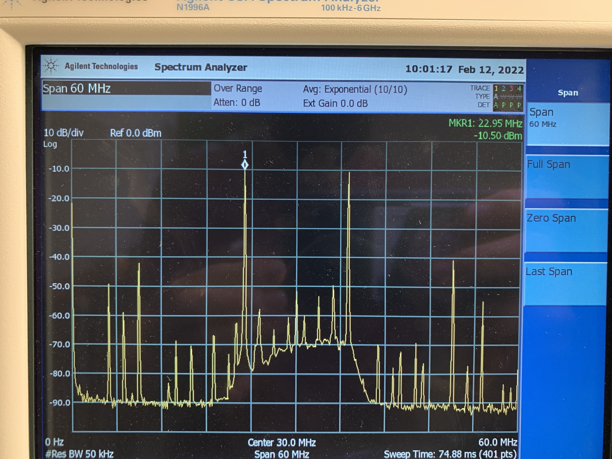
<figcaption>Figure MR.3 - Spur levels of the mixer when the LO is a 7 dBm 30 MHz sinusoid and the RF is a 0 dBm 7 MHz sinusoid. The span of the spectrum is 60 MHz so many spurs can be seen. The up and down mixed IF signals have around -10 dBm power and are distinct from the spurs. </figcaption>
</figure>

The most difficult measurement to make in the lab was the minimum IF because the notion of when to stop was unclear for the author. Intuitively, the minimum IF signal is the signal at the lowest frequency possible that is still discernable from noise and distortion. However, the authors believe that "minimum discernability" is a function of the device that is on the receiver-end of the mixer. In this lab, that device is the spectrum analyzer. 

This belief motivated the investigation shown by figures MR.4,5, and 6. To find the minimum IF frequency, we fixed the LO at 30 MHz and stepped the RF from 7 MHz to 29.99 MHz. The LO was driven with 7 dBm power while the RF signal was driven with 0 dBm.

Figures MR.4,5, and 6 show the IF at 150 kHz, 100 kHz, and 10 kHz. 

<figure>
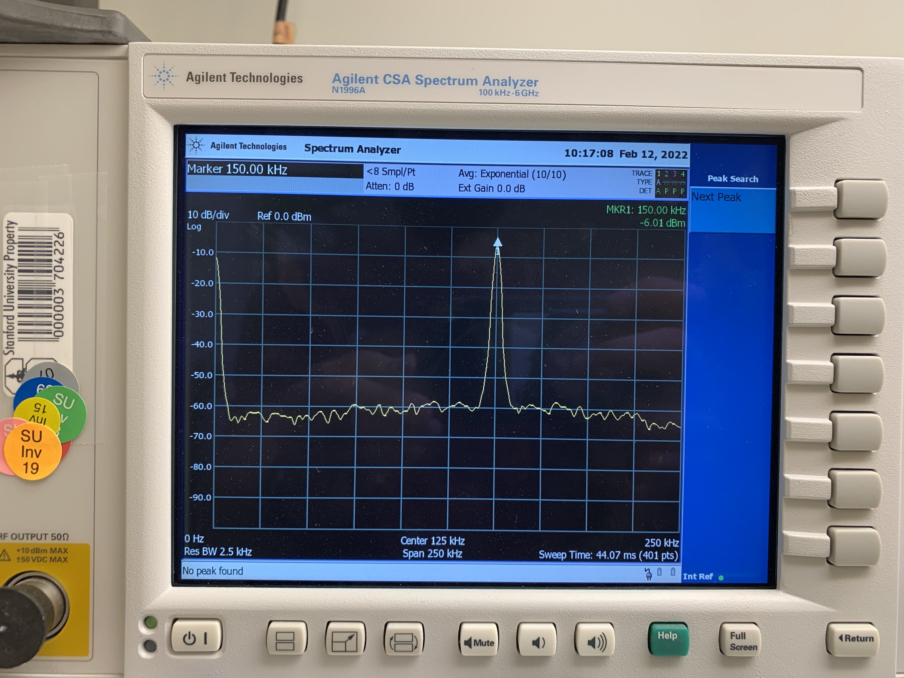
<figcaption>Figure MR.4 - The IF signal from mixing a 30 MHz LO with a 29.85 MHz RF signal. The IF signal is about 50 dBm above the noise floor. The IF signal has a power of -6 dBm. The minimum IF frequency is lower than 150 kHz.</figcaption>
</figure>

<figure>
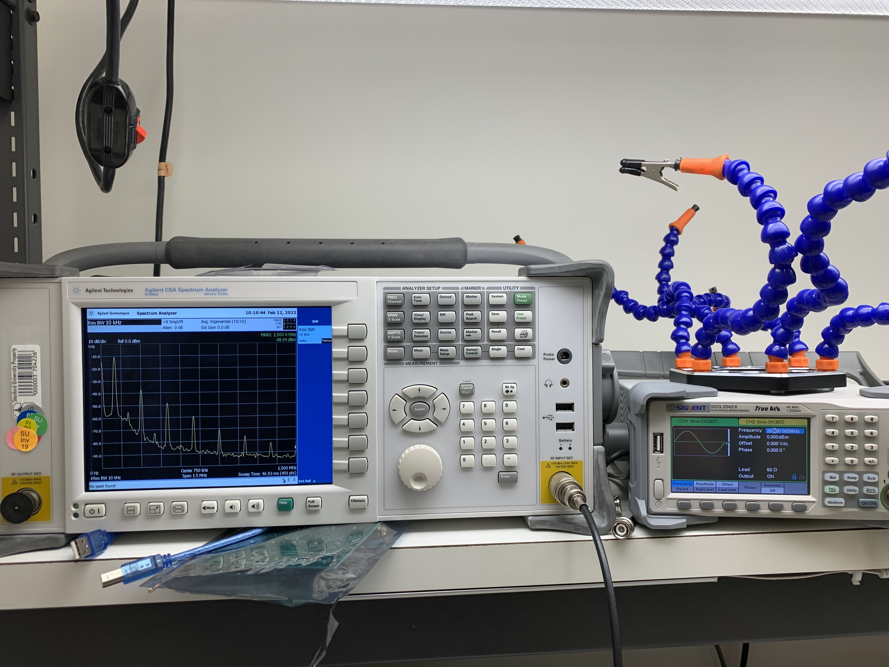
<figcaption>Figure MR.5 - The IF signal from mixing a 30 MHz LO with a 29.90 MHz RF signal. The IF signal is less than 50 dBm above the noise floor. The IF signal has a power of -10 dBm. Intermodulation spurs have about 150 kHz of separation. The minimum IF frequency is lower than 150 kHz.</figcaption>
</figure>

<figure>
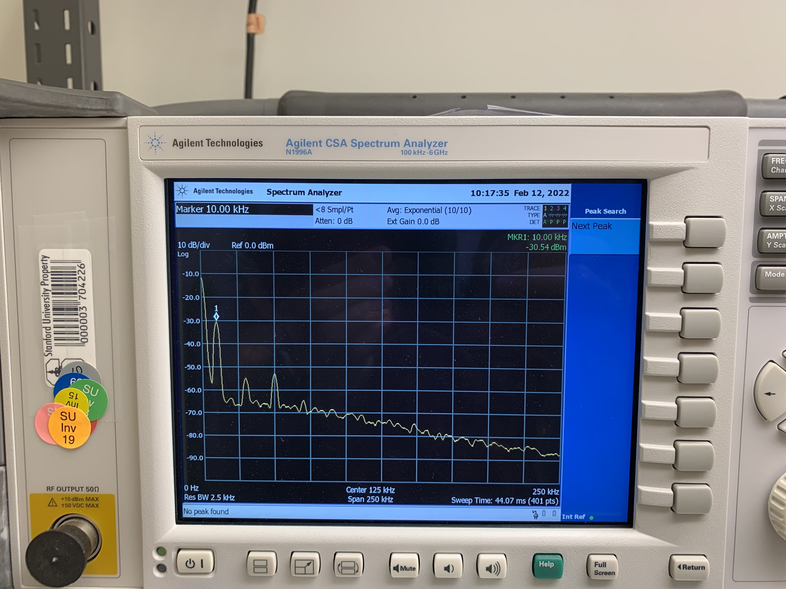
<figcaption>Figure MR.6 - The IF signal from mixing a 30 MHz LO with a 29.99 MHz RF signal. The IF signal is less than 30 dBm above the noise floor. The IF signal has a power of -30 dBm. Intermodulation spurs have about 75 kHz of separation. One confusing part of this line of investigation is that the notion of when the signal is indistguishable is not well defined.</figcaption>
</figure>

The following table summarizes the disappearnce of the IF as the RF frequency was increased:

|RF Frequency [MHz]|Downconverted IF Power [dBm]|
|------------|----------------------|
|29.85| -6|
|29.90| -8|
|29.95| -13|
|29.97| -17.54|
|29.99| -30|

Table 1 - Measured (downconverted) IF power as a function of RF Frequency. LO frequency was fixed at 30 MHz. 

Whether or not -30 dBm is discernable or not in a larger system depends on the rest of the system. When the IF was set to be 0 Hz (DC) the signal disappeared into the existing spur at DC.

## Discussion
todo

The mixer functions as expected, but more background reading of the prior art is needed to place the mixer's performance in the context of commercially available devices. Nevertheless, here we discuss various questions that came up during the lab.

The 1dB compression point was an important metric to find because it describes when the device is exiting its linear operation. Ideally the IF output is linearly proportional to the RF input. As we saw in Figure MR.1, there is a limit to the linearity with the diode-ring mixer. The 1 dB compression point appears to be a property inherent to either the topology of the mixer *or* the choice of devices for the circuit. For the diode-ring topology, there does not appear to be much room to improve the 1 dB compression, other than using more expensive (better) parts.

Local oscillator leakage was another quality of the mixer that stood out. Itself is a spur and can "crowd" the spectrum and potentially "bleed" into frequency ranges of use. One technique to reducing the LO leakage is to filter it out. The ease of filtering out the LO leakage most likely depends on the LO leakage's separation from IF frequencies, since very steep analog filters are difficult to build.

The mixer was only used as a down converter. At the time of doing the lab, the author forgot that mixers could both up and down convert. He was reading a bullet point list of things to do in the lab and forgot to recall the lecture slide which originally presented Figure B.1.

Because the conversion gain is defined as <code>conversion = (IF power)[dBm] - (RF power)[dBm], </code> (see this <a href="https://www.qsl.net/va3iul/RF%20Mixers/RF_Mixers.pdf"> document for more information</a>) only the input power was swept. In other words, the author did not investigate conversion gain versus LO drive level. Because the diode-ring mixer uses passive devices, the author did not think characterizing conversion gain versus LO drive level would yield an insightful result. We expect the conversion gain/loss to follow the same trend across all usable LO drive levels -- what we expect to be different is the value of conversion gain/loss at each measured point. In other words, the conversion gain/loss curve would shift vertically when the LO drive level is modulated.

The conversion gain was measured only at only one LO frequency and one RF frequency. For a more thorough characterization of the mixer, the conversion gain should be measured across different LO and RF frequencies. Time was the limiting factor for collecting this data. 

The ability for a mixer to operate with low IF can be valuable if the application desired the ability to avoid noise. The ability to answer why the built mixer cannot go to zero IF is beyond the author's current understanding of mixers. The common hypothesis is "parasitics".

As was discussed during lecture and lab time, the diode-ring mixer should go to DC. There are two other common variants of the mixer: FET-ring and Gilbert cell. The FET ring version of a switching mixer should not be able to go to DC because it would require the balunced to unbalenced transformer on the IF side to operate in DC. The Gilbert cell mixer should be able to go to DC because an IF at DC for this circuit topology implies one branch is on and the other is off. For transistors, this method of operation is valid. The ability for a mixer to go to DC is determined by the circuit topology.

## Conclusions

The diode-ring mixer demonstrated itself as a viable way of mixing sinusoidal signals. This ability is essential for RF systems and is used for enconding information and frequency shifting, among other applications. The mixer built for this lab is capable of downconverting to IFs as low as 10 kHz, so it may be used for future engineering projects which operate in the kilohertz range. The knowledge gained through this lab can enable the young engineer to make informed decisions regarding mixer selection.